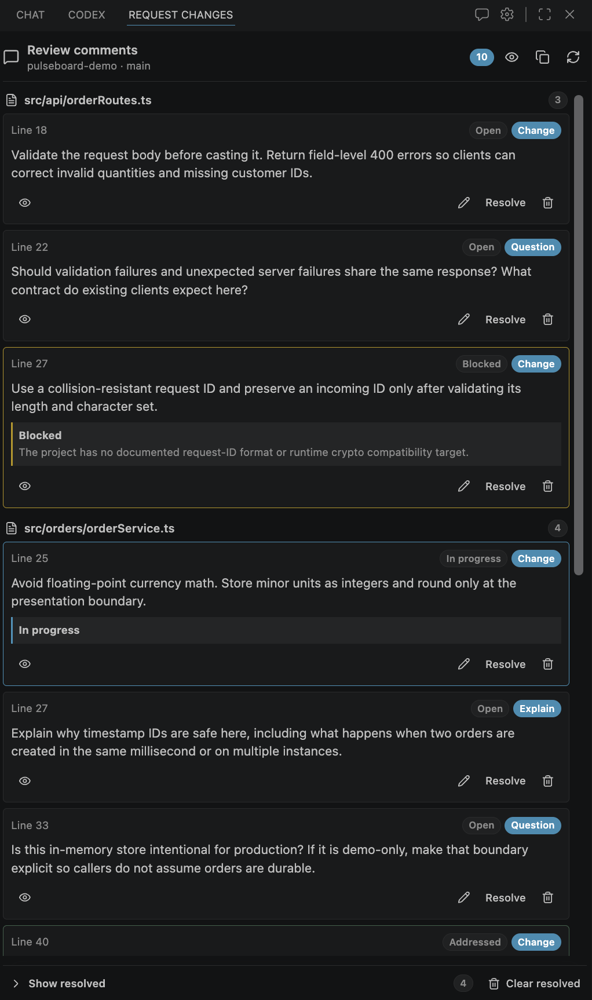
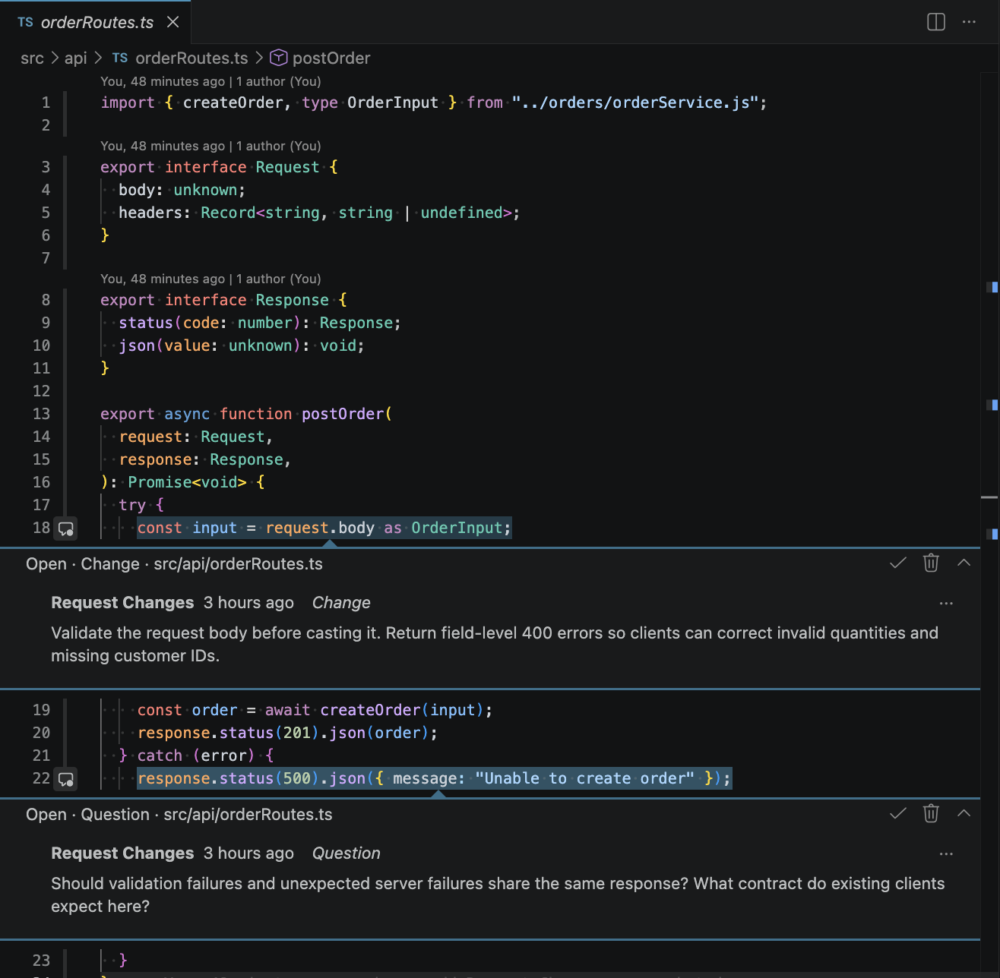
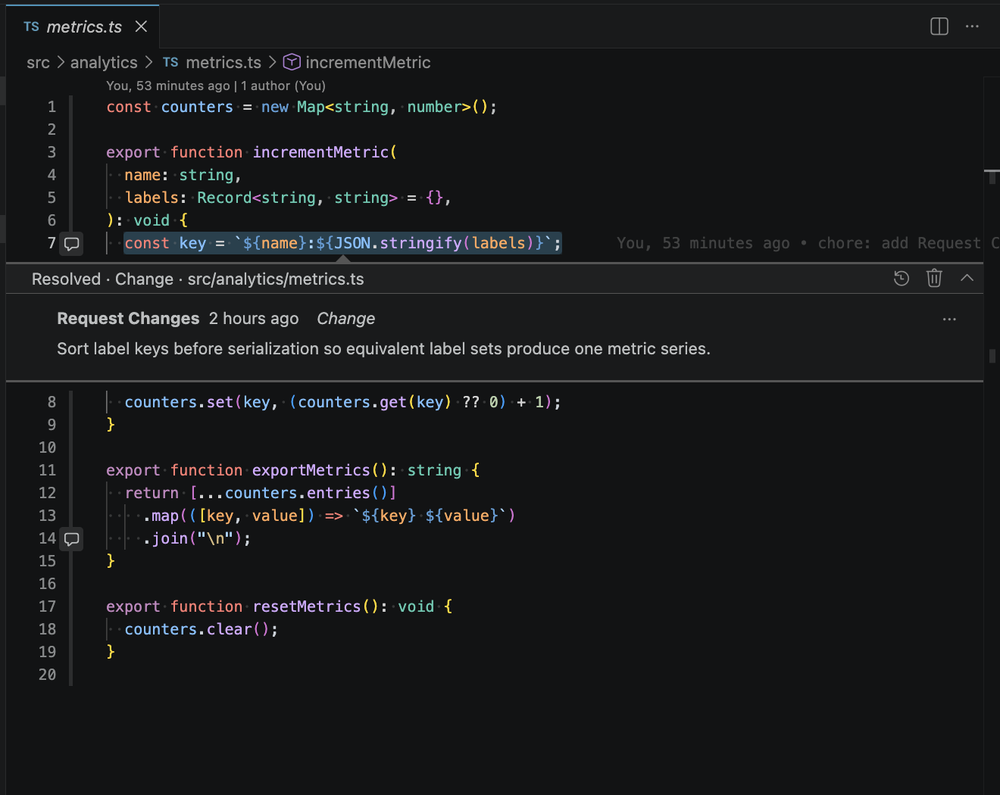
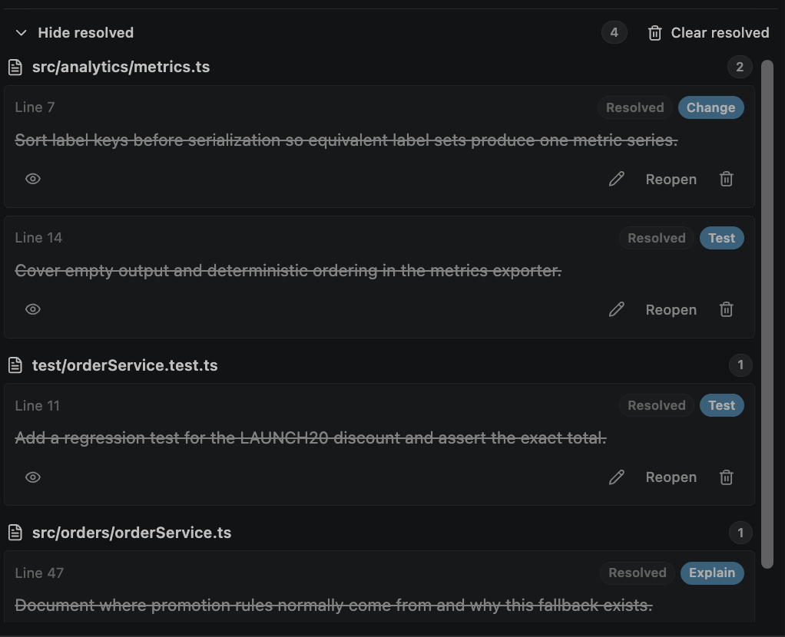
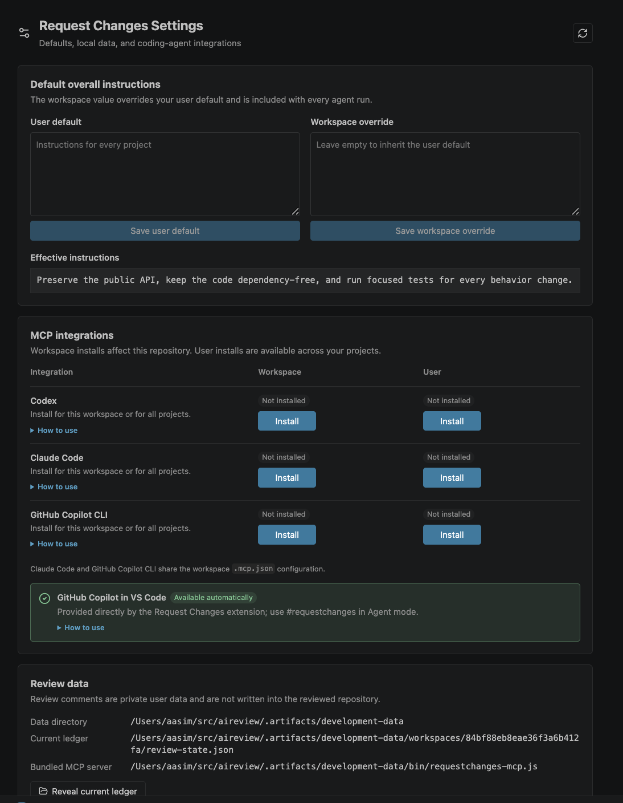

# Request Changes

Request Changes is a VS Code extension for reviewing agent-written code before you accept it. It gives you a pull-request-style review workflow inside your editor: select code, leave inline comments, and ask your coding agent to make the requested changes.

Use it when an agent has produced code that is close, but still needs human review, follow-up questions, explanations, or tests.

## What you can do

- Leave review comments directly on selected code in VS Code.
- Track comments in the **Review Comments** sidebar, grouped by file and status.
- Mark comments as **Change**, **Question**, **Explain**, or **Add Test**.
- Send open review comments back to Codex, Claude Code, GitHub Copilot CLI, or GitHub Copilot in VS Code.
- Keep comments visible until you decide the agent's response is acceptable.
- Resolve, reopen, or clear comments without losing track of the review.

## How it works

1. Review the agent-written code in VS Code.
2. Select the code you want to comment on.
3. Run **Request Changes: Add Review Comment to Selection**, or use the editor comment gutter.
4. Write the change, question, explanation request, or test request.
5. Ask your coding agent to address the open Request Changes comments.
6. Review the agent's updates and resolve comments when you are satisfied.

Agents can mark comments as **Addressed** or **Blocked**, but they do not resolve comments for you. Final acceptance stays with the person reviewing the code.

## Product tour

### Review agent-written code at a glance

Comments stay grouped by file while their Open, In progress, Addressed, and Blocked states make review progress easy to scan.

### Keep reviews attached to code

Native VS Code comment threads keep each request or question beside the exact code under review.

### Resolve without losing history

Resolved comments remain visible in the editor and in a dedicated sidebar section until you decide to clear them.

### Connect your coding agent

Use the settings panel to configure instructions and connect Request Changes to supported agents.

## Supported agents

Request Changes can pass review comments to:

- Codex
- Claude Code
- GitHub Copilot CLI
- GitHub Copilot in VS Code

Open **Request Changes: Open Settings** from the Command Palette, or use the gear icon in the **Review Comments** view. From there you can install or remove the local MCP integration for supported agents, choose workspace or user scope where available, and set default instructions for how agents should respond to your reviews.

## Asking an agent to fix comments

Request Changes is designed to be explicit. Agents only read your review comments when you ask them to.

Examples:

- GitHub Copilot in VS Code: `Fix the open comments with #requestchanges`
- Claude Code: `Use requestchanges to address the open review comments`
- Codex or GitHub Copilot CLI: `Use requestchanges to fix the open review comments`

You can also add extra instructions in the Request Changes settings. For example, you might tell agents to run a specific test command, preserve an API contract, or explain any blocked comments.

## Comment types

New comments default to **Change**. To choose a type while writing a comment, start the comment with one of these directives:

- `#requestchanges:change`
- `#requestchanges:question`
- `#requestchanges:explain`
- `#requestchanges:addTest`

The directive is removed when the comment is saved. You can also change a comment's type later from the **Review Comments** view.

## Privacy and data

Review comments are stored locally as private user data, not as repository files. The extension stores review data under your operating system's application data location:

- macOS: `~/Library/Application Support/Request Changes`
- Windows: `%LOCALAPPDATA%/Request Changes`
- Linux: `$XDG_STATE_HOME/request-changes` or `~/.local/state/request-changes`

Request Changes only sends review comments to an agent when you explicitly ask that agent to use Request Changes.

## Troubleshooting

If an agent cannot see your comments, open **Request Changes: Open Settings** and confirm that the integration for that agent is installed and enabled at the scope you expect.

If comments are not where you expect after editing a file, open the file in VS Code. Request Changes keeps anchors with surrounding context so comments can be reattached when code moves. If a selection was deleted or cannot be matched safely, the comment is kept as an orphaned comment instead of being silently discarded.

For local development, architecture, publishing, and diagnostics details, see [development.md](development.md).
