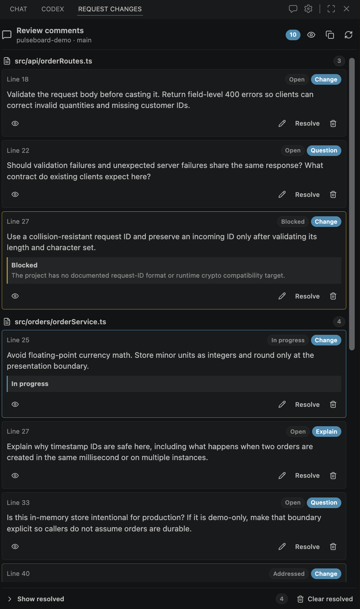
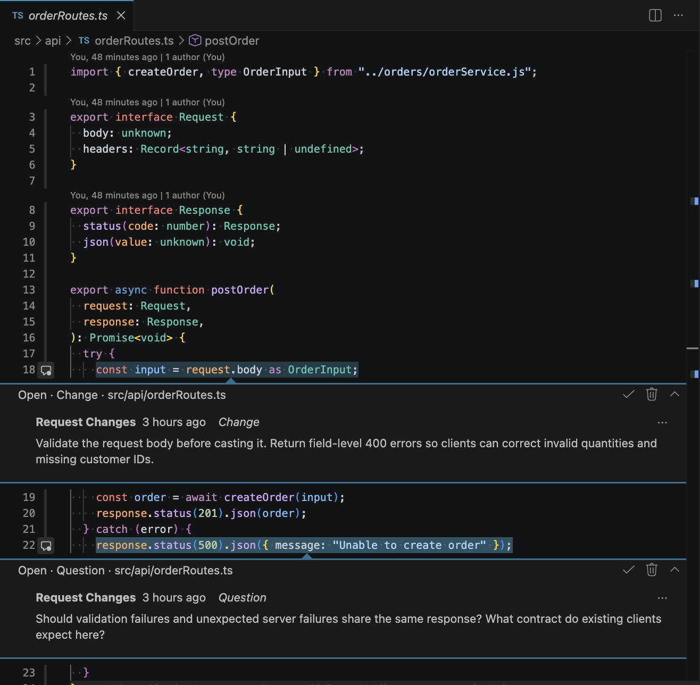
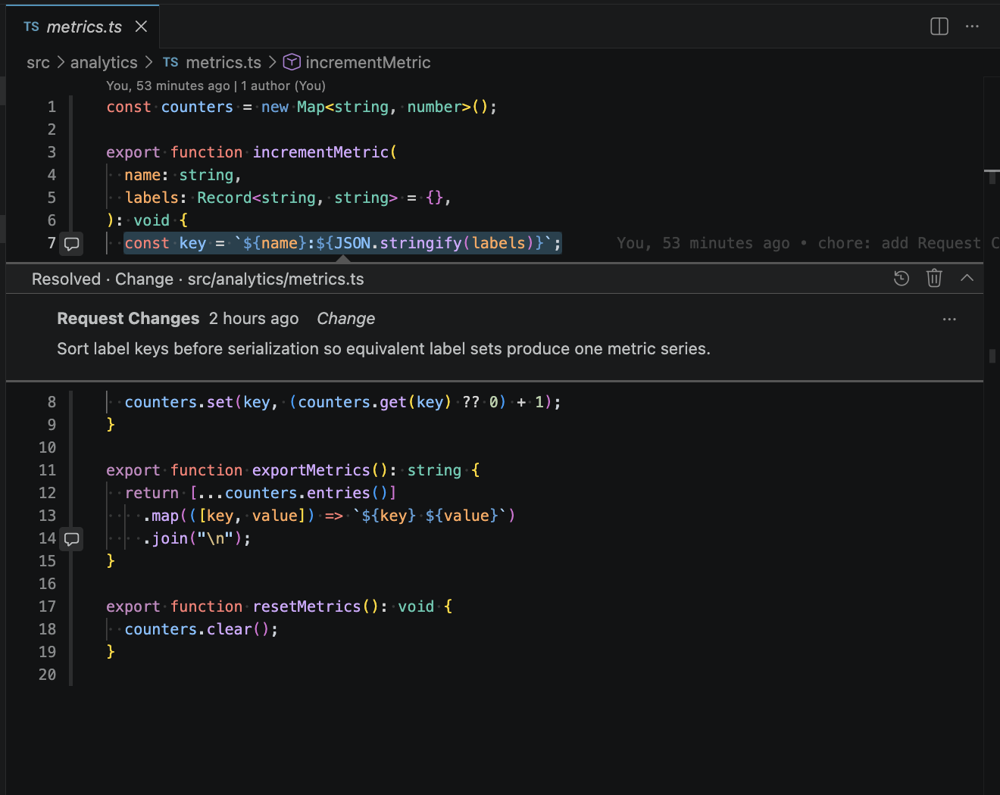
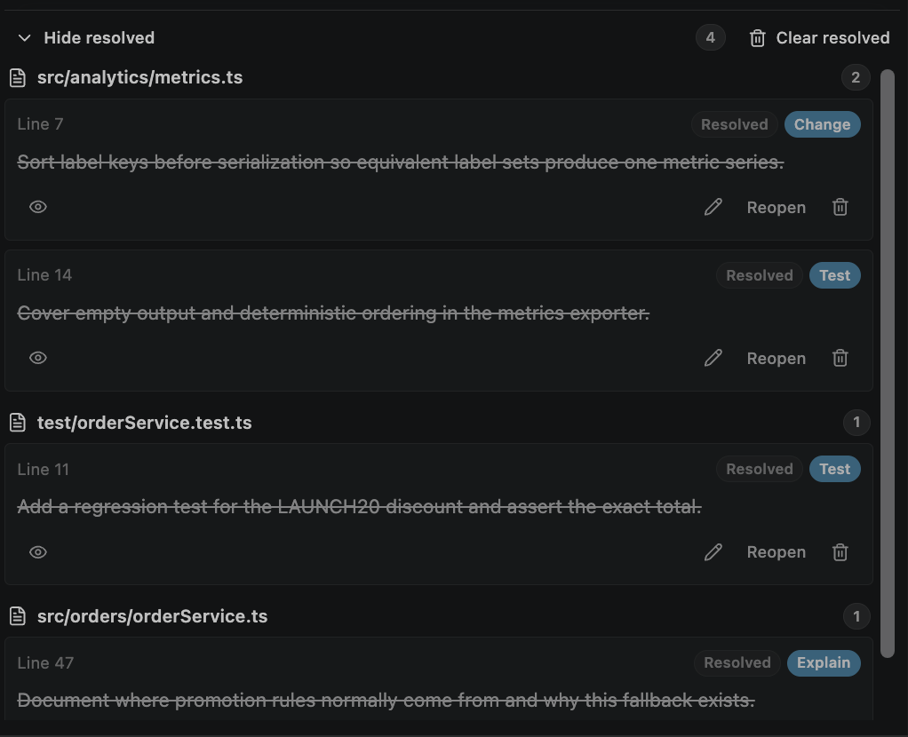
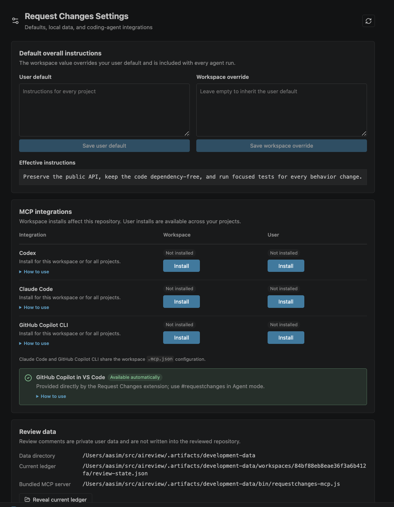

# Request Changes

Request Changes is a VS Code extension for reviewing agent-written code before you accept it. It gives you a pull-request-style workflow inside your editor: select code, leave independent review comments, and give selected comments to your coding agent.

Use it when an agent has produced code that is close, but still needs human review, follow-up questions, explanations, or tests.

## What you can do

- Leave review comments directly on selected code in VS Code.
- Track comments in the **Review Comments** sidebar, organized by status and then file.
- Mark comments as **Change code**, **Answer a question**, **Explain this**, or **Add or update tests**.
- Select the exact open comments to copy for Codex, Claude Code, GitHub Copilot CLI, or GitHub Copilot in VS Code.
- See each agent result as **Resolved** or **Couldn’t resolve**.
- Keep resolved comments visible until you clear them.

## How to use Request Changes

1. Open the workspace that contains the code you want to review.

2. Review the code your agent wrote.

3. Select the exact code that needs feedback.

4. Add a review comment.

    Run **Request Changes: Add Review Comment to Selection** from the Command Palette, right-click the selected code, or use the editor comment gutter.

5. Write the feedback you want the agent to handle.

    New comments default to **Change code**. You can also mark a comment as **Answer a question**, **Explain this**, or **Add or update tests**.

6. Open the **Review Comments** view.

    The sidebar organizes comments as Open, Working, Couldn’t resolve, or Resolved, then groups each section by file.

7. Connect your coding agent.

    Run **Request Changes: Open Settings**, or use the gear icon in the **Review Comments** view. Install the integration for the agent you want to use at Workspace or User scope when an install option is shown.

8. Select the open comments you want processed, copy them for your agent, and ask the agent to use Request Changes.

    Request Changes is explicit: agents only read comments when you ask them to use Request Changes or `#requestchanges`.

9. Review the agent's response.

    The agent reports exactly one terminal result for each claimed comment: **Resolved** or **Couldn’t resolve**.

10. Create a new comment for anything that still needs work.

    Terminal comments never return to an active state. Clear resolved comments when you no longer need their history.

## Product tour

### Review agent-written code at a glance

Comments are organized by status and then file. Only open comments can be selected; working comments are temporarily immutable, and terminal comments show the agent’s result.

### Keep reviews attached to code

Native VS Code comment threads keep each request or question beside the exact code under review.

### Keep completed results until you clear them

Resolved comments remain visible in the editor and in a dedicated sidebar section until you decide to clear them.

### Connect your coding agent

Use the settings panel to configure instructions and connect Request Changes to supported agents.

## Using Request Changes with agents

Open **Request Changes: Open Settings** from the Command Palette, or use the gear icon in the **Review Comments** view. The settings panel shows the integrations Request Changes can manage, where each integration is installed, and example prompts for using it.

You can add default instructions in settings. For example, tell agents to run a specific test command, preserve a public API, or document verification limitations.

### Codex

1. In **Request Changes: Open Settings**, install Request Changes for Codex.

    Use Workspace scope for the current repository, or User scope for every repository.

2. Restart Codex and open the reviewed repository.

3. Run `/mcp` and confirm that `requestchanges` is listed and enabled.

4. Ask Codex:

    `Use the requestchanges MCP server to read open review comments, claim the exact IDs and versions selected for this task, perform each request, run relevant verification, complete every claimed comment as resolved or unresolved, and finish with a concise summary of each comment.`

### Claude Code

1. In **Request Changes: Open Settings**, install Request Changes for Claude Code.

2. Start a new Claude Code session in the reviewed workspace.

3. Run the MCP prompt:

    `/mcp__requestchanges__resolve_review_comments`

### GitHub Copilot CLI

1. In **Request Changes: Open Settings**, install Request Changes for GitHub Copilot CLI.

2. Start a new Copilot CLI session in the reviewed workspace.

3. Ask Copilot CLI:

    `Use the requestchanges MCP server to process the selected open review comments, then summarize each resolved or unresolved result.`

### GitHub Copilot in VS Code

1. Open Copilot Chat in Agent mode for the reviewed workspace.

2. Ask Copilot:

    `Fix the open comments with #requestchanges, then summarize each comment when done.`

Request Changes registers this integration directly with VS Code, so there is no manual MCP install step for GitHub Copilot in VS Code.

### Other MCP-compatible agents

Request Changes currently manages setup for Codex, Claude Code, GitHub Copilot CLI, and GitHub Copilot in VS Code. Other MCP-compatible agents may work if they support stdio MCP servers.

1. Open **Request Changes: Open Settings**.

2. Note the bundled MCP server location and private data location shown in the settings panel.

3. Configure your MCP client to run the Request Changes server with Node.

4. Ask the agent to use the `requestchanges` MCP server to read open review comments, claim the exact IDs and versions selected for the task, complete each as resolved or unresolved, and summarize the results.

For unmanaged agents, exact configuration depends on that agent's MCP client settings.

The MCP server exposes the `requestchanges`, `claim_review_comments`, `complete_review_comments`, and `get_review_status` tools, resources for open and individual comments, and a `resolve_review_comments` prompt. Claims expire after one hour and use opaque tokens so stale or competing agents cannot overwrite results.

## Comment intents

New comments default to **Change code**. To choose an intent while writing an open comment, start it with one of these directives:

- `#requestchanges:change`
- `#requestchanges:question`
- `#requestchanges:explain`
- `#requestchanges:addTest`

The directive is removed when the comment is saved. You can also change an open comment’s intent from the **Review Comments** view.

## Privacy and data

Review comments are stored locally as private user data, not as repository files. The extension stores review data under your operating system's application data location:

- macOS: `~/Library/Application Support/Request Changes`
- Windows: `%LOCALAPPDATA%/Request Changes`
- Linux: `$XDG_STATE_HOME/request-changes` or `~/.local/state/request-changes`

Request Changes only sends review comments to an agent when you explicitly ask that agent to use Request Changes.

## Troubleshooting

If an agent cannot see your comments, open **Request Changes: Open Settings** and confirm that the integration for that agent is installed and enabled at the scope you expect.

If comments are not where you expect after editing a file, open the file in VS Code. Request Changes keeps anchors with surrounding context so comments can be reattached when code moves. If a selection was deleted or cannot be matched safely, the comment is kept and shown as needing reattachment.

For local development, architecture, publishing, and diagnostics details, see [development.md](development.md).
